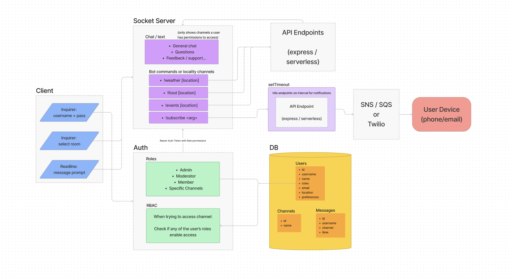

# Travelio

This is a travel-oriented chat service mimicking something close to a discord server. It is a backend-focused project that uses the command line as the UI.

** This is a fork of a group project in which I was the primary contributor. [Notifyme-US](https://github.com/Notifyme-US)

## Author

Julian Barker

### Prior Contributors

Steven Redjukowski

Trace Dugar

## Features

* Simulated discord server based around the theme of travel. Provides the ability to:
  * Allows real-time chatting through a command-line UI
  * Join different rooms for a more focused chat experience (general chat, recommendations, questions, support, commands)
  * hit API endpoints through bot commands.
  * Subscribe to daily summary notifications via email for weather and events.

### Planning

