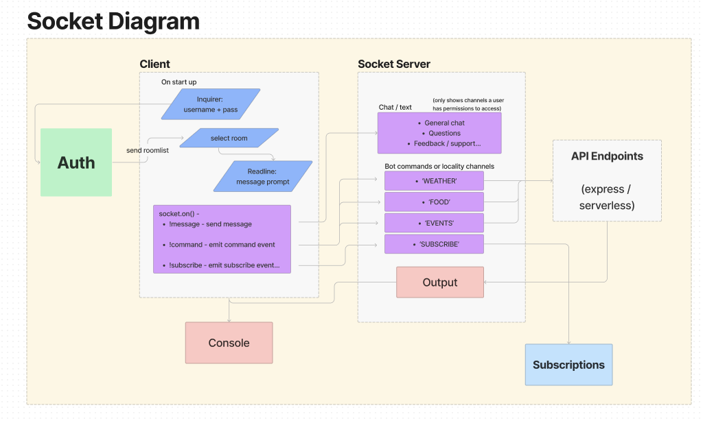
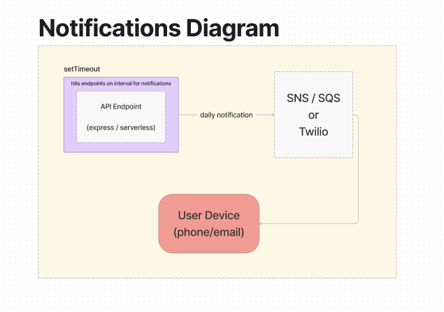

### User Stories

#### 1

Title - Location data

User Story sentence -  as a user I want to be able to get location data based on my location

Feature Tasks - API call, find information by authorized log in for areas they are in or may be traveling to.

Acceptance Tests

* finds location
* calls API properly
_ properly retrieves correct data.

### 2

Title chat /messaging

User Story sentence - as a user I want to be able to log in and chat with others on a channel based on location.

Feature Tasks - proper authorized log in, connection to channel

Acceptance Tests - correctly connects to proper channel, can send and recieve message,

### 3

Title - Log in

User Story sentence - as a user I want to be able to log in and see my information saved and my credentials/roles

Feature Tasks - proper log in and cache of account information

Acceptance Tests - log ins correctly, takes user to correct account and information. User sees correct region.

### 4

Title - get weather based on location

User Story sentence - as a user I want to see the weather based on my location.

Feature Tasks - get proper location services/ API calls, correct weather for location.

Acceptance Tests - correct location, correct weather, correct events for location, etc.

### 5

Title - Admin Capabilities

User Story sentence - AS an Administrator I want ot be able to block innappropriate / inflamatory users

Feature Tasks - able to block users, able to update user profiles, able to update user access to chat rooms.

Acceptance Tests - correctly blocks a user, correctly updates user(s) profile(s), correctly blocks access per roles.

### 6

Title - Subscribe to general chat

User Story sentence - As a user I want to be able to subscribe to the general chat channel/room

Feature Tasks - Can connect to and subscribe to general chat channel/room.

Acceptance Tests - Properly authorizes user based on RBAC to connect, view, message, etc. in general chat as well as subscribe to be notified of new messages, content on general chat channel/room.

### 7

Title - Admin control/ RBAC users control

User Story sentence - As an admin I want to be able to add and remove a user from roles, channels, etc.

Feature Tasks - RBAC control to add and or remove users to channels/rooms and change their access.

Acceptance Tests - Admin has proper RBAC to add and remove users from channels/rooms.

### 8

Title - Admin control/ RBAC channels control

User Story sentence - As an admin I want to be able to add and remove channels/rooms

Feature Tasks - RBAC control to add and or remove channels/rooms and change their access.

Acceptance Tests - Admin has proper RBAC to add and remove channels/rooms.

